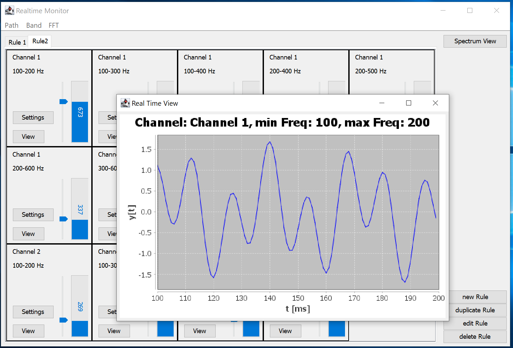
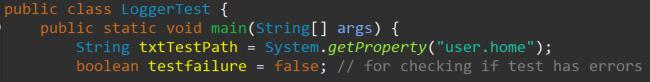
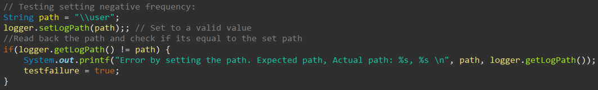
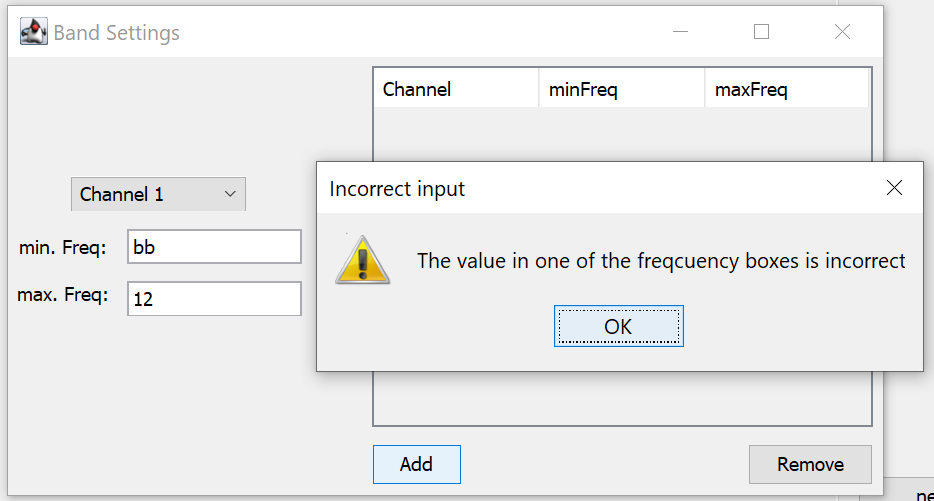

# Projekt-2 Realtime Monitor

## Projektbeschrieb
Bei dem Projekt handelt es sich um eine Realtime Monitor für spektrale Leistungdichte.
Bei der Software können verschieden Channels und Bänder eingestellt werden und dazu Regeln hinterlegt werden.
Dabei kann bei jedem Band einer Regel der maximale Leistungspegel eingestellt werden.
Wird der Pegel überschritten wird eine Alarm ausgelöst.

## Software-Test
Das Testen der Software wird in zwei Teile aufgeteilt:
Im ersten Teil werden die wichtigsten Models einzel durch eine seperate main-Methode getestet.
Dabei werden die Methode mit gültigen und ungültigen Werten aufgerufen und untersucht ob das Verhalten richtig ist.
Bei einem Fehlverhalten sowie bei einem erfolgreichen Test wird der Benutzer informiert.
### Bsp. main:

### Bsp. set and get:

Als zweites wird die Software über das GUI getestet. Dabei werden z.B. Bänder und Regeln angelegt und überprüft ob alles richtig angezeigt wird.
Zudem werden in Eingabefelder ungültige Daten eingegen und das Verhalten der Applikation getestet.
Des weiteren wird überprüft ob sich die GUI-Elemente richtig verhalten beim ändern der Framegrösse.
### Bsp. incorrect input by band:

## Softwareinbetriebnahme
Die Software kann mit oder ohne GUI gestartet werden. Um Einstellungen zu treffen wird die Software vorzugsweise mit einem GUI gestartet.
Die Settings werden in einem JSON-File gespeichert und bei Start der Applikation wieder eingelesen.
Die Einstellung für den Pfad des Config-File erfolgt über das Menüband der Applikation mit Klick auf Path.\

Möchte man die Software ohne GUI aufstarten (z.B. Embedded System) kann in dem JSON-Configurationsfile eine bool-Variable entsprechend auf false werden.\
\
Die Software wird anschliessend ohne GUI gestartet.\

# FHNW_pro2
